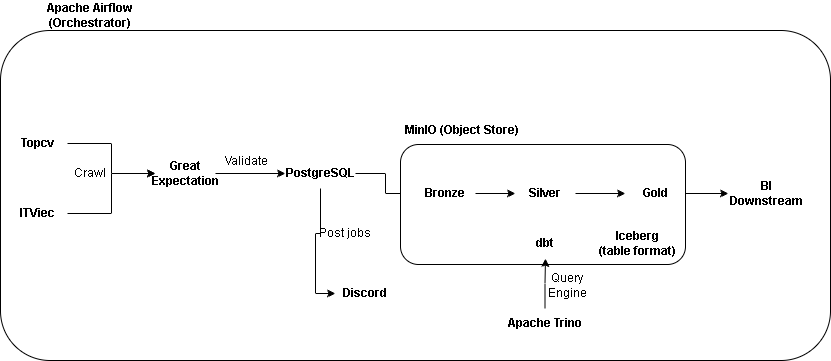
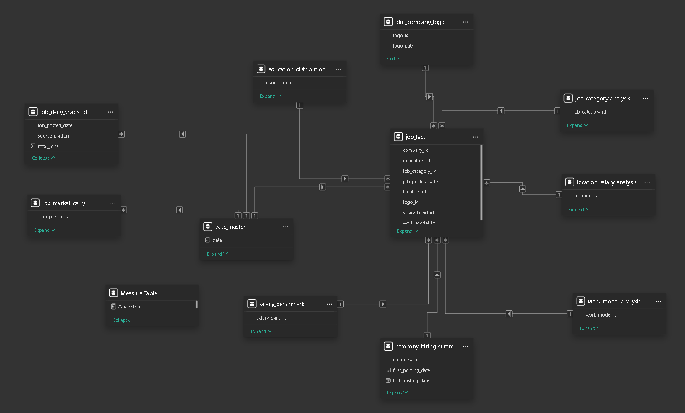
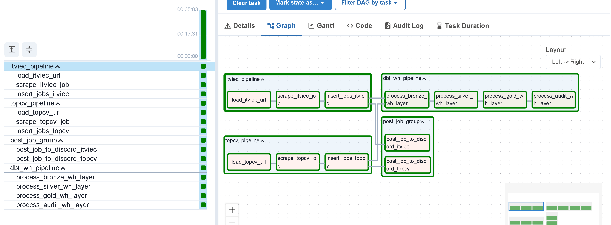
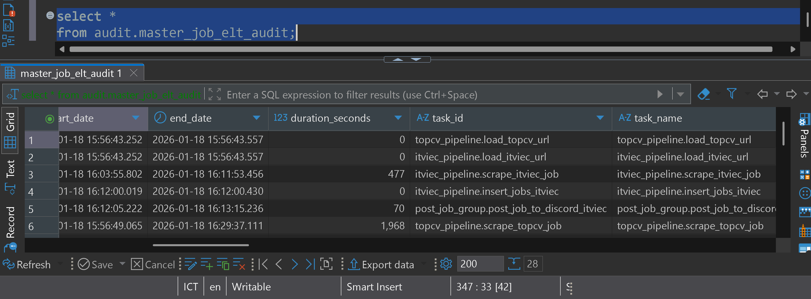
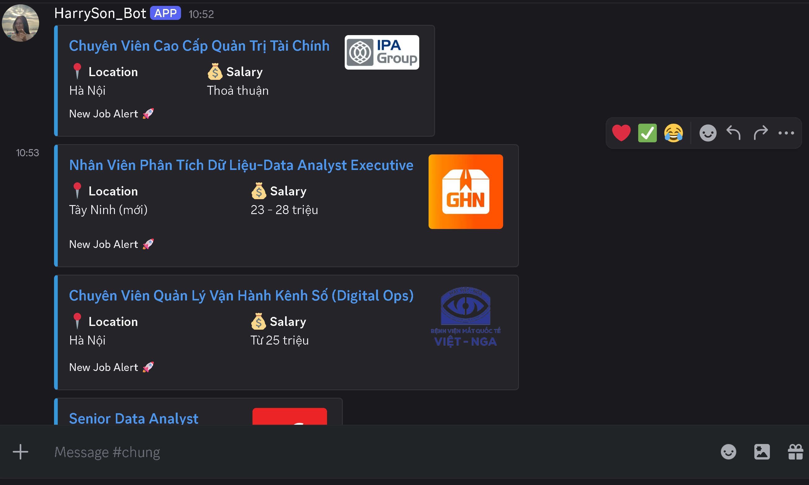
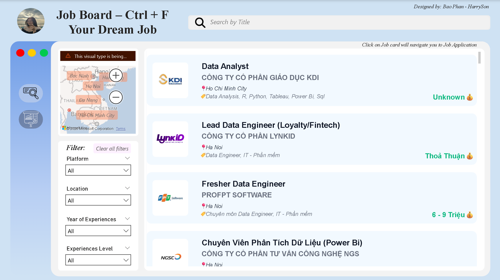
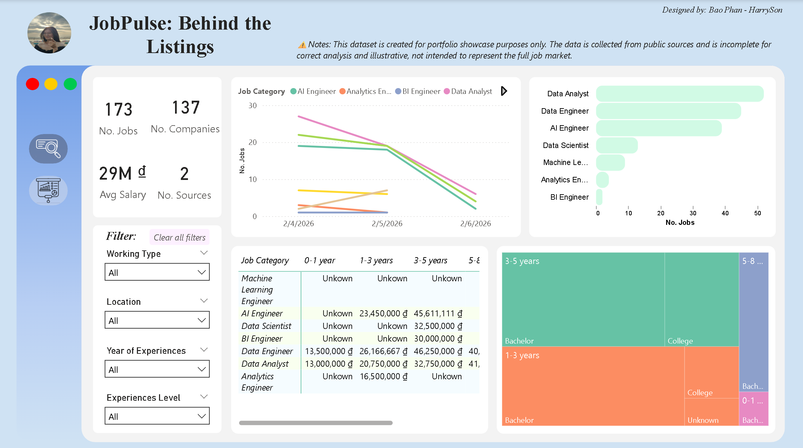

# 🚀 Job Crawling & Analytics Pipeline

An end-to-end **Data Engineering project** that automatically crawls job postings from multiple websites, ingests raw data into **PostgreSQL** and **MinIO**, publishes curated job alerts to **Discord**, and builds a modern **Lakehouse-style Data Warehouse** using **dbt**, **Apache Trino**, and **Iceberg**.

The entire pipeline is orchestrated with **Apache Airflow** and follows the **Medallion Architecture (Bronze → Silver → Gold)** to ensure scalability, data quality, and analytics readiness.

**Power BI** dashboard for job searching and current data market analysis.

> ⚠️ This project is built for **learning, experimentation, and portfolio showcase** purposes.

---

## 🌟 Project Highlights

* 🔎 **Automated job crawling** from job websites (ITViec, TopCV)
* 🧱 **Medallion Architecture** with dbt (Bronze / Silver / Gold)
* ❄️ **Lakehouse design** using Iceberg + Trino + MinIO
* 📣 **Discord job alerts** with deduplication
* 🛠 **Airflow orchestration** with modular DAGs
* ☁️ **Object storage** powered by MinIO
* 🔄 **Upsert & incremental processing** for efficiency
* ✅ **Data quality validation** with Great Expectations (pre-staging checks)
* ✅ **Task Auditting** with custom callback functions, enable task audit performance.
* 📰**Job Analysis** with Power BI.
## 🎯 Project Objectives

This project aims to:

1. Crawl job postings from multiple sources (currently **ITViec** and **TopCV**, could extend more sources)
2. Validate data with **Great Expectation** before storing them.
3. Store raw and processed data in:
   * **PostgreSQL** (staging / operational layer)
   * **MinIO + Iceberg** (analytical lakehouse)
4. Automatically publish **new job alerts to Discord** without duplicates
5. Transform and model data using **dbt** following Medallion Architecture.
6. Create semantic model for BI consumption and dashboard for data job market analysis.
7. Future enhancement features such as:

   * 🤖 Discord chatbot for job recommendations *(maybe when I’m 60 🤣)*

---
## ⚙️ How to set up project
* Prerequisite: Installed Make and Docker on your machine.
* **Commands**:

  1. **make up** to start building images and containers.
  2. **make down** to stop and delete all containers.
  3. **make clean** to clean whole docker (images, containers, volumes).

---
## 🏗️ High-Level Architecture

```
┌─────────────────┐
│  Job Sources    │
│ (ITViec, TopCV) │
└────────┬────────┘
         │
         ▼
┌─────────────────┐
│ Python Crawlers │
│ (Selenium+bs4)  │
└────────┬────────┘
         │
         ▼
┌───────────────────┐
│ Great Expectation │
│ (Data Validation) │
└────────┬──────────┘
         │
         ▼
┌─────────────────┐       ┌─────────────────┐
│  PostgreSQL     │─────▶│ Discord Channels │
│  (Staging)     │        │   (Job Alerts)  │
└────────┬────────┘       └─────────────────┘
         │
         ▼
┌─────────────────┐
│   dbt + Trino   │
│  (Bronze/Silver │
│   / Gold)       │
└────────┬────────┘
         │
         ▼
┌──────────────────────┐
│ BI / Analytics Tools │
└──────────────────────┘
```



---

## 🔄 Data Pipeline Flow

### 1️⃣ Crawling Stage (Bronze Ingestion)

* **Airflow DAGs**:

  * `itviec_data_pipeline`
  * `topcv_data_pipeline`
* **Trigger**: Manual (for running single source only)
* **Steps**:

  1. Load source URLs from JSON configuration files
  2. Scrape job postings using **Selenium + ChromeDriver**
  3. Extract structured job information
  4. **Validate raw data with Great Expectations (per source)**
  5. Upsert records into PostgreSQL staging tables
  6. Identify unposted jobs
  7. Publish jobs to Discord
  8. Mark jobs as posted to avoid duplicates

  * `master_dag`
* **Trigger**: Daily
* **Steps**:

  1. Run topcv and itviec pipeline (scrape data and ingest into staging layer).
  2. Post unposted jobs to Discord channel and run dbt pipeline for data lakehouse data.

---

### 2️⃣ Staging Layer (PostgreSQL)

* **Schema**: `staging`
* **Purpose**: Operational storage
* **Key Features**:

  * `ON CONFLICT` upsert logic
  * `posted_to_discord` flag for idempotency

**Tables**:

* `staging.itviec_data_job`
* `staging.topcv_data_job`

---

### 3️⃣ Transformation Layer (dbt – Medallion Architecture)

#### 🥉 Bronze Layer (`models/bronze/`)

* Raw data mirrored from PostgreSQL staging
* Minimal transformations
* **Materialization**: Incremental tables

#### 🥈 Silver Layer (`models/silver/`)

* Cleaned & standardized data
* Deduplication, normalization, validation
* **Materialization**: Tables

#### 🥇 Gold Layer (`models/gold/`)

* Business-ready analytical models
* Optimized for reporting & insights
* **Materialization**: Tables

📘 Get more detail documentation with:

```bash
dbt docs serve --port 8085
```

---

## 📣 Discord Integration

* Automatically posts **new job alerts**
* Rich **Discord embeds** with:
  * Job title
  * Company
  * Location
  * Salary (if available)
* Built-in:
  * Error handling
  * Logging
  * Duplicate prevention

---


## ⏱ Airflow DAGs Overview

### `itviec_data_pipeline`

* **Schedule**: Manual Run (configurable - for specific run only - for testing - ...)
* **Tasks**:

  1. Load URLs
  2. Scrape jobs
  3. Insert / upsert jobs
  4. Post new jobs to Discord

### `topcv_data_pipeline`

* Same structure as ITViec pipeline

### `master_dag`

* **Schedule**: Daily.
* **Tasks**:

  1. Run ITViec and Topcv Pipeline (Scrape jobs, validate data with GE and insert into Staging layer).
  2. Post un-post jobs to Discord channel.
  3. Run dbt Pipeline.

---

## 🧪 Testing

Basic test scripts are available under `scripts/test/`:

* `test_crawl_it_viec.py`
* `test_crawl_topcv.py`
* `test_db_conn.py`
* ...

> These tests mainly ensure scripts are **runnable**, not full unit tests.

--

## 📰Data job market analysis

Create semantic models for Power BI consumption. Ingest models into Power BI, create Job Board for job searching purposes, Analysis for overall data market analysis (salary, top demand data job,...).
This is the report url for your reference: [Link](https://app.powerbi.com/view?r=eyJrIjoiNDQzMjI0MDAtYjA5OS00MDQxLTliNGUtN2UxYzBlYjYyNzQ3IiwidCI6ImY4ZTM0OThkLWQwNjItNDkzYi1hYTBhLWJmMzBhMDk1ZTY0NyIsImMiOjEwfQ%3D%3D)


--
## 🖥️ Images

- Master dag of JobPulse.


- Audit layer.


- Discord jobs post


- Job Board


- Job Analysis


## 👤 Author
**Bao Phan (HarrySon)**

---

⭐ If you find this project useful, **please give the repo a star** — its much helps! 😋🔥
